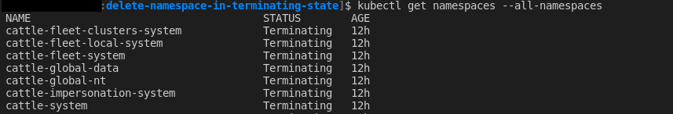

# delete-namespace-in-terminating-state
Un espacio de nombres está atascado en el estado Terminando

referencia: https://www.ibm.com/docs/en/cloud-private/3.2.0?topic=console-namespace-is-stuck-in-terminating-state

* Tener en ejecución el proxy de kubectl:
  
  kubectl proxy

  